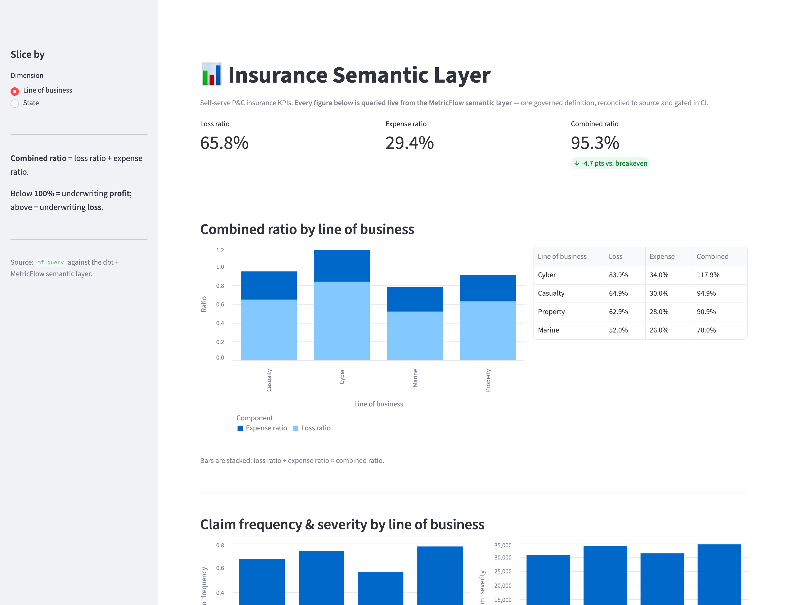

# Insurance Semantic Layer (dbt + MetricFlow)

[](https://github.com/ssbiradar3/insurance-semantic-layer/actions/workflows/ci.yml)


> **Trusted by design.** Every metric is reconciled to source and gated in CI —
> if a number drifts from the system of record, the build fails. A metric is
> trusted because it reconciles and passes the gate, not because of who authored
> it. New here? Start with the [Project Overview](docs/PROJECT_OVERVIEW.md), see
> [how to test what a dashboard or an AI reports](docs/TESTING_AI_ANSWERS.md), or
> launch the [interactive dashboard](#dashboard).



A trusted, self-serve semantic layer for Property and Casualty insurance, built
on dbt and MetricFlow and running locally on DuckDB with zero warehouse cost.
Synthetic policy, claim, and exposure data is enriched with a third-party vendor
feed, and every metric is reconciled to source and gated in CI before it can
reach a dashboard.

The goal of this repo is not just to define metrics. It is to make them
**trustworthy**: a stakeholder can self-serve `loss_ratio` by state or line of
business and know the number ties back to the raw source, because a
reconciliation test proves it on every build.

### Built across three lenses

This project shows the full arc of owning a data product — framing it, building
it to last, and using it to answer a question:

- 🧭 **Product** — a real problem (untrusted KPIs → bad pricing/reserving
  decisions) shipped as a governed, self-serve product with users, success
  metrics, and a roadmap.
- 🛠️ **Engineering** — `staging → marts → semantic` dbt modeling, **incremental**
  facts + **SCD2** history, reconciliation-to-source tests, unit tests, and CI.
- 📊 **Analytics** — P&C fluency, used to produce an actual insight (which book
  and which states drive the combined ratio).

See [docs/PROJECT_OVERVIEW.md](docs/PROJECT_OVERVIEW.md) for the three-lens
write-up, the product thinking, and the analyst's read.

## Architecture

```
  seeds (raw P&C data + vendor flood feed)
        |
  staging  (stg_*)            cleaned, typed, one model per source
        |
  marts    (dim_*, fct_*)     gold star schema, vendor feed joined onto exposures
        |
  semantic (sem_*, metrics)   MetricFlow semantic models + governed KPIs
        |
  consumers                   BI tools / APIs / natural-language, all one definition
```

Quality gates run at every layer: schema tests in staging, vendor-join integrity
in marts, reconciliation tests against source, and `mf validate-configs` on the
semantic layer.

## The vendor data story

In a real specialty insurer, exposures are enriched with commercial third-party
feeds. This repo uses a free, openly modelled flood file as a reproducible
stand-in so the project runs anywhere. The mapping:

| Vendor category (real world)        | Stand-in in this repo        |
| ----------------------------------- | ---------------------------- |
| Catastrophe / peril (Verisk, RMS)   | `raw_vendor_flood` flood zone + risk score |
| Property characteristics (CoreLogic)| location attributes in `raw_locations`      |
| Geocoding                           | lat / long in `raw_locations`               |

The vendor feed is joined onto the exposure dimension in `dim_location`, and the
join is validated: a relationships test plus an `UNKNOWN` accepted-values check
proves no exposure is silently dropped or left unmatched.

## Metrics

Defined once in `models/semantic/_metrics.yml`, queryable everywhere:

- Simple: `written_premium`, `earned_premium`, `incurred_loss`, `underwriting_expense`, `claim_count`, `policy_count`
- Ratio: `loss_ratio`, `expense_ratio`, `claim_frequency`, `claim_severity`
- Derived: `combined_ratio` (`loss_ratio + expense_ratio`) — the headline
  underwriting-profitability KPI; below 1.0 is an underwriting profit.

`loss_ratio` spans two semantic models (loss from claims, premium from policies)
and MetricFlow builds the join automatically through the shared `policy` entity.
`combined_ratio` is a derived metric composed from `loss_ratio` and
`expense_ratio`, and every one of these reconciles to source (see the
`assert_*` tests).

## How trust is enforced

1. **Reconciliation tests** (`tests/assert_*`) recompute the headline numbers
   straight from the raw seeds and fail the build if the gold tables diverge by
   more than a tolerance. This is the pattern you extend to compare a metric
   against a legacy or certified source of truth.
2. **Vendor-join integrity** proves the third-party enrichment did not drop or
   fan out rows.
3. **Semantic validation** (`mf validate-configs`) confirms the metrics resolve
   against the warehouse.
4. **CI gate** (`.github/workflows/ci.yml`) runs all of the above on every push
   and pull request. Nothing merges red.

A metric is trusted because it reconciles and passes the gate, not because of who
or what authored it.

Because these gold numbers feed downstream systems (EDW, Oracle GL, ceded
reinsurance) and roll up into externally-reported financial results, the
reconciliation tests are **source-to-target reconciliation expressed as code** —
the control that keeps a wrong figure out of a financial report, run on every
build instead of as a manual spreadsheet tie-out. See
[docs/SOURCE_TO_TARGET.md](docs/SOURCE_TO_TARGET.md) for the mapping of each
governed number to its source and its reconciliation control.

## Data quality checks

Tests run at every layer and all execute in `dbt build` / CI:

- **Keys & integrity** — `unique` + `not_null` on every primary key; `relationships`
  (foreign-key) tests from facts to dimensions.
- **Domain validity** — `accepted_values` on enums (line of business, status, flood
  zone, claim status) and `dbt_expectations` range checks on amounts and scores.
- **Cross-column logic** — e.g. `written_premium >= earned_premium`.
- **Vendor-join integrity** — proves the third-party feed neither drops nor fans
  out exposures.
- **Reconciliation to source** — five singular `assert_*` tests tie gold metrics
  back to the raw source of record (the differentiator most demos lack).
- **Volume monitors** — `dbt_expectations.expect_table_row_count_to_be_between` on
  the facts (the native equivalent of an anomaly/volume test).
- **Logic regression** — a dbt **unit test** pins the earned-premium proration math.
- **Change history** — an SCD2 snapshot (`policy_status_snapshot`) tracks status
  changes over time (`dbt_valid_from` / `dbt_valid_to`).
- **Semantic validation** — `mf validate-configs` checks every metric resolves.

Observability: `bash scripts/docs.sh` generates an interactive lineage + catalog
report (DuckDB-compatible). See [docs/OBSERVABILITY.md](docs/OBSERVABILITY.md) for
the monitoring approach and why Elementary is the production (non-DuckDB) upgrade.

## Data refresh (incremental)

The fact tables are **incremental**: on a refresh, only rows from a newer
ingestion batch are processed, keyed off a `loaded_at` watermark.

```bash
python scripts/simulate_refresh.py   # appends the next dated batch to the seeds
dbt build                            # incremental: only the new batch is processed
```

- `fct_premium` / `fct_claim` use `materialized='incremental'` with a
  `unique_key` and a `where loaded_at > max(loaded_at)` filter.
- [`scripts/simulate_refresh.py`](scripts/simulate_refresh.py) appends a new dated
  batch (internally consistent, so reconciliation still ties out).
- [`.github/workflows/scheduled-refresh.yml`](.github/workflows/scheduled-refresh.yml)
  runs daily: initial load → simulate a batch → incremental rebuild → full
  reconciliation gate. It proves a scheduled refresh keeps trust green.
- A full rebuild is `dbt build --full-refresh`.

In production this same pattern runs against the warehouse on an orchestrator
(Airflow / Dagster / dbt Cloud) with `dbt source freshness` on the ingested
tables — see [docs/PRODUCTION.md](docs/PRODUCTION.md).

## Claude Code automation

- `CLAUDE.md` is the project constitution Claude reads each session.
- `.claude/settings.json` defines a PostToolUse hook: whenever a model, metric,
  or test file is edited, the full gate (`scripts/validate.sh`) runs
  automatically, so a broken or unreconciled metric surfaces immediately instead
  of in production.

## Quickstart

```bash
pip install dbt-duckdb dbt-metricflow
dbt deps
python scripts/generate_data.py
export DBT_PROFILES_DIR=$(pwd)
dbt build              # builds models, runs every test incl. reconciliation
mf validate-configs    # validates the semantic layer
mf query --metrics loss_ratio,claim_frequency --group-by policy__line_of_business
```

## Dashboard

An interactive Streamlit dashboard where **every figure is queried live from the
MetricFlow semantic layer** (via `mf query`) — not re-derived in the app. It's the
"consumers" box in the architecture made real: one governed definition, rendered
for a stakeholder.

```bash
pip install -r app/requirements.txt
bash scripts/dashboard.sh          # builds first if needed, then opens :8501
# or: streamlit run app/streamlit_app.py   (with DBT_PROFILES_DIR set)
```

It shows portfolio-wide loss / expense / **combined ratio** KPI cards, a combined-ratio
breakdown by line of business or state (stacked into its loss + expense
components), and claim frequency / severity — all sliceable from the sidebar
(pictured at the top of this README).

### Deploy it to the web (Streamlit Community Cloud)

The dashboard is deploy-ready, so a stakeholder can click a URL and explore it —
no install. The app **self-bootstraps**: on first load it builds the dbt + DuckDB
warehouse if it's missing, then serves. Steps:

1. Repo is public on GitHub (done).
2. Go to [share.streamlit.io](https://share.streamlit.io), sign in with GitHub,
   and **Create app → From existing repo**.
3. Repo: this one · Branch: `main` · Main file: `app/streamlit_app.py`.
4. **Advanced settings → Python 3.11** (dbt + MetricFlow need 3.11/3.12).
5. **Deploy.** First load builds the warehouse once (~1–2 min); later loads are instant.

The root `requirements.txt` installs the full stack. Note: Vercel / Netlify are
*not* suitable — Streamlit needs a long-running server, not serverless functions.
Hugging Face Spaces or Render work too if you want more memory.

## Documentation

- [docs/PROJECT_OVERVIEW.md](docs/PROJECT_OVERVIEW.md) — a one-page narrative
  (problem → solution → proof → impact).
- [docs/TESTING_AI_ANSWERS.md](docs/TESTING_AI_ANSWERS.md) — how to test what a
  dashboard or an AI reports: the semantic layer as the trust boundary.
- [docs/SOURCE_TO_TARGET.md](docs/SOURCE_TO_TARGET.md) — source-to-target mapping
  (STM) for each governed number, with the reconciliation control that proves it
  ties back to source (the control you'd put on a GL / financial feed).
- [docs/PRODUCTION.md](docs/PRODUCTION.md) — how the **same project** runs inside
  a company: warehouse swap, the `seeds` → `sources` migration, environments,
  orchestration, CI, and governance.
- [docs/OBSERVABILITY.md](docs/OBSERVABILITY.md) — monitoring approach (volume
  anomalies, the `dbt docs` report) and the Elementary production path.

## Targeting Snowflake later

Everything is warehouse-agnostic dbt. The `prod` and `ci` Snowflake targets are
already defined in `profiles.yml` (credentials via `SNOWFLAKE_*` env vars). Set
the variables and run `dbt build --target prod`. The real structural change for a
company is `seeds` → declared `sources` (one line per staging model); see
[docs/PRODUCTION.md](docs/PRODUCTION.md). Models, tests, and metrics do not change.

## Repo layout

```
seeds/                raw synthetic data + vendor feed (CSV)
models/staging/       cleaned source models + schema tests + _sources.yml (prod ref)
models/marts/         gold dim/incremental-fct models + vendor join + tests
models/semantic/      MetricFlow semantic models, metrics, time spine
snapshots/            SCD2 policy-status history
tests/                singular reconciliation / parity tests
app/                  Streamlit dashboard (queries the semantic layer live)
scripts/              data generator, refresh simulator, docs + validation gate
docs/                 overview, production, observability, testing-AI notes
.claude/              Claude Code hook config
.github/workflows/    CI + scheduled incremental refresh
```
